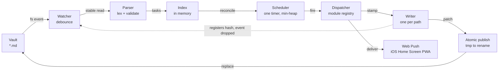

# Vakt — Software Design Document

**Status:** Ready for estimation · **Milestones:** 6 · **Basis:** PRD v1

A file-reactive household task orchestrator with no database. A directory of Markdown files is the single source of truth; a Go daemon watches it, schedules it, fires notifications, and writes state back into the same plain text — one directive span at a time.

---

## 1. Locked decisions

Settled before this document was written. Each one closes off alternatives rather than deferring them, and the milestone structure assumes all six hold.

| Decision | Choice | Consequence |
|---|---|---|
| **Stack** | Go backend, TypeScript/React PWA | Chosen for a process whose job is to run for months watching files and holding timers. Cost accepted: two toolchains and a codegen bridge. |
| **Push delivery** | Web Push / VAPID to an installed PWA | No Apple Developer account, no native shell. Requires the user to add Vakt to their Home Screen, and requires a trusted certificate. |
| **Deployment** | Docker Compose, vault on a bind-mounted local disk | Reliable filesystem events and atomic renames. Network and sync-backed vaults are out of scope. |
| **Parsing authority** | The backend is the only parser | The browser never interprets a directive. Everything semantic goes through `/api/v1/parse`. |
| **Data volume** | Fetch the whole vault, filter in the client | No server-side filtering or pagination. A household vault is small; scale work is not MVP work. |
| **Concurrency policy** | Deferred post-MVP, with a boundary | Write *mechanics* ship now. Multi-writer *policy* does not. See §5. |

---

## 2. Architecture

### 2.1 The governing principle

Vakt is written in two languages, which normally means the directive grammar gets implemented twice — once in Go for the engine, once in TypeScript for the editor's autocomplete and linting. Two implementations of a grammar drift, and cron semantics drift worst: the editor would call a line valid while the daemon silently refused to schedule it.

So the frontend does not parse. The Smart Editor is an **authoring aid, not a semantic engine** — it inserts text and opens pickers, using a directive registry it fetches at runtime plus a small lexer that answers only "which token is the cursor inside." Every semantic question — is this valid, when does it fire next, what does this line mean — is answered by `POST /api/v1/parse`. Single user, LAN, debounced keystrokes: latency is not a concern, and the Go parser becomes the sole authority by construction rather than by discipline.

> **Accepted cost.** Editing offline loses live linting. The editor still works; the lint indicator reports that validation is unavailable. On a home-network deployment this is a rare state.

### 2.2 Reactive cycle



The cycle is closed, which is why echo suppression (the dotted edge) is load-bearing rather than an optimization: the daemon's own write is a filesystem event like any other, and without the hash registration that edge would feed the watcher indefinitely. Every writeback travels through a single serialized writer per path and reaches disk by atomic rename, so a reader sees the old file or the new one and never a partial.

### 2.3 Deployment topology

One container. The Go binary serves the API and the built React bundle from the same origin, which sidesteps CORS entirely and means one certificate covers everything. Two volumes are mounted, and the distinction between them is architectural rather than cosmetic.

```
/vault    bind mount, read+write — user content
          Markdown files. The single source of truth for tasks.

/config   named volume, read+write — system state
          VAPID keypair, push subscriptions, runtime settings.
```

> **Why two volumes.** "No database" does not mean "no state." A VAPID keypair and the list of enrolled push subscriptions must survive restarts, and they are emphatically not user content — putting them in the vault would surface machine secrets in the user's file browser and inside their git history. System state lives on its own volume, and the vault stays exactly what the PRD promises: the user's files.

### 2.4 Secure context requirement

This constraint does not appear in the PRD and it gates the entire MVP. iOS delivers Web Push only to a PWA the user has added to their Home Screen, and service workers register only in a secure context. A vault server reached at `http://192.168.1.40:8080` registers no service worker, so it takes no push subscription, so `ios_notifications` — the sole MVP integration — does not function.

A trusted certificate on a LAN service is therefore a prerequisite, not a packaging detail. The recommended path is **Tailscale**: `tailscale cert` issues a genuine certificate for a `*.ts.net` name, the service stays private to the tailnet, and reminders keep working away from home. Alternatives are a `mkcert` local CA with a root profile installed per device, or a real domain with DNS-01 ACME and split-horizon DNS.

If none proves workable, the honest fallback is a relay such as ntfy or Pushover, whose native app removes the secure-context problem — which is precisely why M1 exists and comes first.

### 2.5 Schema-first contract

Two files are the source of truth for both languages. `schema/directives.yaml` holds the directive registry — name, arity, value type, whether it is required, whether it is system-written, and which UI helper it opens. `schema/openapi.yaml` holds the v1 API contract.

Go types come from `oapi-codegen`, TypeScript types from `openapi-typescript`, and the registry compiles to constants on both sides. A CI check fails the build when committed generated code diverges from the schema. The registry is also served live at `GET /api/v1/directives`, so the editor renders its helpers from what the running daemon actually supports — adding a directive post-MVP ships with the backend and needs no frontend release.

### 2.6 Package layout

```
cmd/vaktd/                        entrypoint, config, wiring

internal/engine/                  the reactive core
  vault/                          walking, reading, atomic write, per-path writer
  directive/                      lexer, typed values, validation, surgical patcher
  index/                          in-memory task index, reconciliation
  watcher/                        fsnotify, debounce, stability, echo suppression
  schedule/                       cron evaluation, timer heap, suppression ladder
  dispatch/                       module registry, payload templating, outcomes

internal/api/                     inbound adapter — handlers, SSE hub, static serving
internal/integration/webpush/     outbound adapter — ios_notifications
internal/model/                   Task, State, Diagnostic — generated from schema
internal/events/                  internal bus

schema/                           directives.yaml, openapi.yaml
web/                              React PWA
```

`internal/` is Go's compiler-enforced visibility boundary rather than a domain name — packages beneath it cannot be imported from outside this module. The grouping inside it carries the architecture: **`engine/` is the core**, holding everything that makes Vakt react to files and fire on time, with no knowledge of HTTP or of any particular notification provider. `api/` adapts requests inward; `integration/` adapts dispatches outward. Both depend on the engine; the engine depends on neither. That is what makes adding a Home Assistant or MQTT module post-MVP purely additive, and what lets the whole engine be tested without a server running.

### 2.7 Two implementation notes worth fixing now

**Watch directories, not files.** Atomic publish replaces the inode, so a watch registered against a file path stops receiving events after the first write. Watches go on directories throughout.

**One timer, not one per task.** The scheduler keeps a min-heap of next fire points and arms a single timer to the earliest, rebuilding on index change. This keeps the reasoning about correctness in one place and removes a class of leaked-timer bugs as tasks are edited in and out of existence.

---

## 3. Resolved specification gaps

The PRD leaves these underspecified. Each is answered below so the team never has to guess, and each is a product judgment worth reviewing — if any ruling is wrong, it is cheaper to overturn here than in code.

**G1 — Task identity is `@id`, unique across the whole vault.** There is no database, so no surrogate key can survive a restart. `@id` is the key in every URL and every client-side collection.

**G2 — Renaming an `@id` is a delete plus a create.** There is no identity continuity. Prior timestamps remain in the file as text, but the system treats the result as a new task.

**G3 — `@id` must match `[a-z0-9_-]{1,64}`.** Anything else raises an error diagnostic and the task is not scheduled. This also keeps URL path encoding trivial.

**G4 — Duplicate `@id`: first wins.** Ordered by path then line number, the first occurrence schedules normally; every later one raises an error diagnostic and does not schedule.

**G5 — A task line without `@id` does not schedule** and raises a warning diagnostic. Tasks created through the API get an id generated from the title slug, with a numeric suffix on collision.

**G6 — `triggered` returns to `active`** on fulfillment, or when the next scheduled slot arrives — whichever comes first. A recurring task cannot become stuck in `triggered` because nobody confirmed it.

**G7 — Suppression precedence.** Evaluated in strict order at every fire point. Ordering matters: a blanket `@skip_until` must not silently burn a queued `@skip_count`.

1. `@state` is not `active` or `triggered` → suppress, no side effects.
2. `@skip_until` is in the future → suppress, nothing decrements.
3. `@last_completed` falls inside the current window → suppress, nothing decrements.
4. `@skip_count` is above zero → suppress, decrement by one, write back.
5. Otherwise → dispatch.

**G8 — The early-fulfillment window** runs from the previous fire point, inclusive, to the upcoming one, exclusive. A `@last_completed` inside it bypasses exactly one trigger.

**G9 — One timezone for the whole vault,** from the `TZ` environment variable, with local-time cron semantics. Spring-forward skips an 02:30 daily job; fall-back fires it once. Per-task timezones are deferred.

**G10 — Triggers missed while the daemon was down are skipped,** logged, and recorded with `@reason`. No catch-up in the MVP — a reminder arriving six hours late is worse than one that never arrives.

**G11 — An `@once` already in the past** when first parsed, with no `@last_triggered`, is treated as missed under the same rule. It does not fire on startup.

**G12 — Payload variables** are `{{title}}`, `{{id}}`, `{{file_path}}`, `{{triggered_at}}`, and `{{state}}`. An unknown variable is left literal and raises a warning diagnostic rather than failing dispatch.

**G13 — A failed push sets `@state(failed)` with `@reason`** and waits for a manual clear in the UI. Automatic retry is deferred.

**G14 — A `404` or `410` from a push endpoint prunes that subscription.** The task fails only if no subscriptions remain — one dead phone must not mark the household's reminders broken.

**G15 — A file that fails to parse is never written to.** Its last known-good schedule stays live and the diagnostic surfaces in the UI. For a reminder system, a stale reminder firing beats a silent one that does not.

### State reference

`active` · `triggered` · `paused` · `completed` · `failed`

Note that `triggered` means *dispatched*, not *delivered*. Web Push returns no delivery receipt, so the strongest claim the system can make is that the push service accepted the message.

---

## 4. Milestones

Six milestones, each ending in something demonstrable. The ordering is deliberately not layered: the riskiest unknown in the project is whether iOS Web Push works at all in this deployment, so it is proven first, on permanent architecture, before an engine is built that assumes it.

> **Restructured after M1 shipped — four milestones remain.** M1 overshot into later milestones: the app shell, aggregated feed, task cards, and push enrolment (M4) all exist, as do the production image, Compose file, volume and environment contract, and the start of the operator runbook (M6). The dispatch module (M3) is not just built but device-verified. What was left of M4 and M6 was thin enough to ship together, and the editor reads better as optional polish on a working product than as a gate before packaging — which is what this document already says about it.
>
> | Was | Now |
> |---|---|
> | M1 Foundation & Push Viability | ✅ shipped |
> | M2 Parser & Vault I/O | **M2** — unchanged, still the whole remaining engine core |
> | M3 Scheduler & Dispatch | **M3** — unchanged, minus the dispatch module already shipped |
> | M4 API & Dashboard + M6 Packaging & Release | **M4** — collapsed; M6's smoke suite is M4's contract tests against the container |
> | M5 Inline Smart Editor | **M5** — unchanged, moved last |
>
> Two endpoints this document's architecture assumes were never written into the contract: `GET /api/v1/directives` lands in M4 (thin — the registry is already generated), and `POST /api/v1/parse` at the start of M5, where it is first consumed.
>
> The per-milestone prose below is unchanged and remains the rationale; `issues/milestone*.md` carry the task-level scope boundaries.

### M1 — Foundation & Push Viability

**Goal:** Prove an iOS push arrives, through real architecture, before anything else is built.
**Demo:** A phone on the sofa buzzes, from a test run.
**Exit:** *Automated* — the hermetic end-to-end test is green in CI. *Acceptance* — a human has watched a real notification land on a Home Screen iPhone.

Repository and Compose scaffold, the TLS path chosen and standing, both schema files authored, the codegen bridge with a drift check in CI, the directive lexer, a read-only vault index, the integration module interface, the `ios_notifications` module, the subscription store, the trigger endpoint, and a PWA shell sufficient to install and enrol.

> **Why this milestone is heavy.** The demo comes out of the test harness rather than from throwaway code, so nothing here gets deleted later. The seams needed to test — a swappable integration module, a seeded vault, a recorded dispatch — are the same seams the architecture needs anyway. The push module is exercised by pointing a *fabricated subscription* at a local recording server: a subscription object carries its own endpoint URL, so the test path and the production path are byte-for-byte identical, with no test-only branch anywhere in the code. That recorder becomes the assertion backbone for M3.

> **On device verification.** A real subscription is a secret — endpoint plus `p256dh` plus `auth` — and it is device-bound and expiring. Committing one would leak a credential and rot besides. The device check lives behind a build tag, reads from a gitignored local file, and never enters CI. It is milestone acceptance, not a CI gate.

> **On schema depth.** The Task DTO is where the parsing-authority decision is enforced or quietly lost. If it ships raw directive text and lets the client work out when a task fires next, the frontend grows a cron library and the architecture unwinds through one plausible-looking pull request. The DTO must carry derived fields — next fire, schedule summary, effective suppression state — which means M1 designing against a screen that does not get built until M4. The shape freezes here; the scheduler that populates it arrives in M3.

### M2 — Parser & Vault I/O

**Goal:** Read, validate, and surgically rewrite vault files without losing a byte, and react to external edits instantly.
**Demo:** Edit a file in vim; the index reflects it within a second. Patch a directive; a byte-diff shows only that span changed.
**Exit:** Golden corpus green, byte-preservation property test green, the debug CLI emits tasks and diagnostics.

Typed value parsing and validation for every directive, the diagnostics model, the surgical patcher, atomic and serialized writing, the in-memory index, the filesystem watcher with debounce and echo suppression, index reconciliation, and the internal event bus.

> **Non-negotiable in this milestone.** Vakt never re-serializes a file from its parsed model. It computes a byte-range replacement for one directive span on one line and passes every other byte through untouched. This preserves the user's formatting, keeps vault diffs clean for the many people who keep Markdown in git, and — because writes are this narrow — shrinks the damage from the multi-writer race we deliberately deferred.

### M3 — Scheduler & Dispatch

**Goal:** Correct timing, correct suppression, correct writeback.
**Demo:** Add a task in vim; it fires on schedule; `@last_triggered` appears in the file and the phone buzzes.
**Exit:** The suppression matrix passes under a deterministic clock, and the cron conformance table is pinned.

Cron evaluation against a pinned library and a golden conformance table, next-fire computation, the min-heap scheduler, the suppression ladder from G7, the state machine, fulfillment processing, writeback orchestration, the missed-trigger policy, payload templating, and delivery outcome handling.

> **The conformance table earns its keep.** Pinning one cron library is not enough on its own — the table of expression, reference time, and expected next fire is what makes a future library swap fail loudly instead of silently rescheduling the household.

### M4 — API & Dashboard

**Goal:** See and act on the whole vault from a phone.
**Demo:** Open the PWA, see every task ordered by next fire, tap Fulfill, watch the file change on disk.
**Exit:** Contract tests pass against the OpenAPI spec, and every quick action round-trips to the vault.

The full HTTP surface including task actions, file and directory endpoints, the runtime directive registry, the parse endpoint, and the SSE hub; then the app shell, the aggregated feed, task cards, quick actions with optimistic update, the vault browser, and push enrolment.

> **This milestone ships a usable product on its own.** Authoring can happen in Obsidian or any text editor while Vakt handles scheduling, dispatch, and state. M5 is authoring ergonomics on top of a system that already works.

### M5 — Inline Smart Editor

**Goal:** Author a valid scheduled task on a phone, thumbs only.
**Demo:** On an iPhone, create a working recurring task without typing a complete directive by hand.
**Exit:** The mobile test pass is clean in iOS Safari standalone mode.

CodeMirror in Markdown mode, the cursor-context lexer, `@` autocomplete driven by the runtime registry, contextual helpers for dates, enums and cron, the mobile accessory bar, and backend-driven linting with a graceful offline state.

> **Every semantic behaviour here is served by the backend.** The editor inserts text and renders what the parse endpoint tells it — including the cron preview, so the editor and the daemon can never disagree about when something fires.

### M6 — Packaging & Release

**Goal:** Someone who has never seen the repository can install and run it from the runbook.
**Demo:** Wipe the box, follow the runbook, receive a push.
**Exit:** A clean-machine install succeeds unaided and the smoke suite passes against it.

Production image and Compose file, the documented volume and environment contract, first-run experience, the end-to-end smoke suite, the operator runbook, a performance sanity pass at household-plus scale, and the deferred register written up as decisions rather than absent work.

---

## 5. Deferred register

Deliberate exclusions, recorded so they read as decisions rather than oversights. The first two were designed during planning; those designs are carried into M6 so the work does not need re-derivation.

**Multi-writer concurrency policy.** Conditional writes with ETag and `If-Match`, `409` handling, optimistic retry re-anchored on `@id`, and conflict-resolution UX. *Accepted consequence:* if a file is open in the Smart Editor when a task inside it fires, saving can erase that timestamp. Single user on a home network, so the collision is rare and its cost is one lost stamp.

**Retry and backoff.** A failed push sets `failed` and waits for a manual clear. No exponential backoff, no automatic recovery from a transient network drop.

**Missed-trigger catch-up.** Triggers missed during downtime are skipped rather than fired late. A configurable catch-up window is the obvious follow-up.

**Additional integrations.** Home Assistant, Slack, MQTT, and generic webhooks. The module interface lands in M1 specifically so these are additive.

**Per-task timezones.** One vault-wide timezone in the MVP.

**Network and sync-backed vaults.** iCloud, Syncthing, and SMB break reliable file events and atomic writes. Supporting them needs a polling fallback and a conflict-file strategy.

**Calendar sync, flow builder, authentication.** Out of scope per PRD §8.

---

## 6. Risks

| Risk | Response |
|---|---|
| iOS Web Push needs a secure context and a Home Screen install; either could prove impractical in this deployment | M1 exists to find out in week one, while switching to a relay is still cheap. |
| Web Push returns no delivery receipt | Accepted and made explicit in the model: `triggered` means dispatched, never delivered. |
| The Home Screen install requirement is a real UX cliff for a household member who does not know what a PWA is | Enrolment is treated as product copy in M4, not as a technical step. |
| Cron semantics drift if the library is ever swapped | One implementation server-side, pinned, with a conformance table that fails the build on any behaviour change. |
| The filesystem watcher silently drops events under load or on some filesystems | A periodic safety rescan backs up the event stream. |
| The OpenAPI contract proves wrong after frontend work has begun | M1 validates it against a real screen before anyone builds on it; the `/v1` prefix keeps a breaking correction survivable. |
| An editor save erases a timestamp written by the daemon | Knowingly accepted; surgical patching keeps the loss to a single directive span. |

---

## 7. Critical path & parallelism

The milestone sequence is the critical path: each one depends on the last. M2 and M3 together are roughly half the total effort and both are backend-only.

**Where work runs in parallel.** Once M1 has validated the API contract against a real screen, the entire frontend — the dashboard in M4 and all of M5 — can be built against a mock server generated from the spec, in parallel with M2 and M3. Within M3, payload templating and delivery outcome handling depend on the module interface from M1 rather than on the scheduler, so they can proceed alongside the timing work. The operator runbook should accumulate as decisions are made rather than being written from memory at the end.

**Where it cannot.** M3 genuinely needs M2 finished. The scheduler writes back through the surgical patcher and the serializing writer, and the suppression matrix asserts on resulting file bytes — so a parser that is still moving makes the scheduler untestable.

> **The one thing that will feel wrong at the time.** M1 spends three to four days on schema design before writing a line of product code, most of it on a single DTO. That will feel disproportionate. It is the price of parallelising the four milestones that follow, and of keeping the browser out of the parsing business — which is the decision the rest of this architecture rests on.
